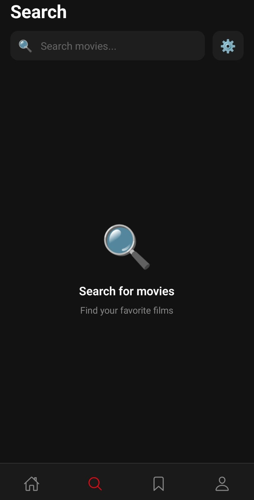
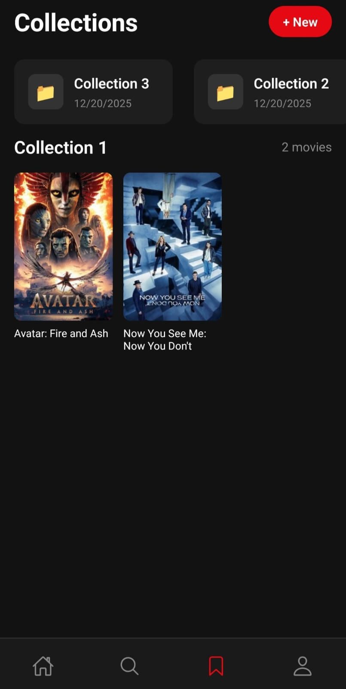
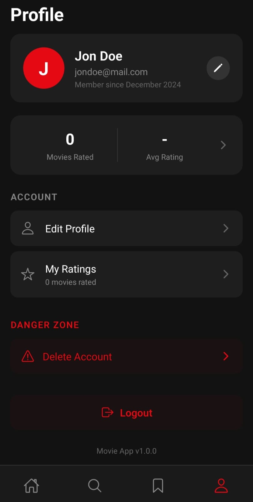

# 🎬 Movie App

A React Native mobile application for discovering, searching, and managing your favorite movies. Built with Expo and powered by The Movie Database (TMDB) API.

## ✨ Features

- 🔍 **Search Movies** - Search for any movie in TMDB's extensive database
- 🎯 **Personalized Recommendations** - Get movie recommendations based on your preferences
- ⭐ **Rate Movies** - Rate movies and keep track of your ratings
- 📚 **Collections** - Create and manage your movie collections
- 👤 **User Authentication** - Secure login and registration system
- 🎨 **Modern UI** - Beautiful dark theme interface

## 🛠️ Tech Stack

- **Frontend**: React Native with Expo
- **Navigation**: React Navigation (Native Stack + Bottom Tabs)
- **State Management**: React Context API
- **Local Storage**: Expo SQLite, Expo Secure Store
- **Backend**: Node.js with Express
- **Database**: SQLite (Better-SQLite3)
- **API**: TMDB (The Movie Database)

## 📋 Prerequisites

- Node.js (v16 or higher)
- pnpm (recommended) or npm
- Expo CLI
- Android Studio (for Android development) or Xcode (for iOS development)
- Expo Go app on your mobile device (for testing)

## 🚀 Getting Started

### 1. Clone the repository

```bash
git clone <repository-url>
cd Movie-app
```

### 2. Install dependencies

```bash
# Install frontend dependencies
pnpm install

# Install server dependencies
cd server
pnpm install
cd ..
```

### 3. Configure API Keys ⚠️ IMPORTANT

You need to create a configuration file with your TMDB API key.

#### Get your TMDB API Key:

1. Go to [TMDB Website](https://www.themoviedb.org/)
2. Create a free account or log in
3. Go to your [Account Settings](https://www.themoviedb.org/settings/account)
4. Click on **API** in the left sidebar
5. Click on **Create** or **Request an API Key**
6. Choose "Developer" and accept the terms
7. Fill in the required information (you can put your app name and a brief description)
8. Copy your **API Key (v3 auth)**

#### Create the config file:

Create a file at `src/config/index.ts` with the following content:

```typescript
// API Configuration
// Replace placeholder values with your actual API keys

export const TMDB_API_KEY = 'YOUR_TMDB_API_KEY_HERE';
export const TMDB_BASE_URL = 'https://api.themoviedb.org/3';
export const TMDB_IMAGE_BASE_URL = 'https://image.tmdb.org/t/p';

// Backend API URL - change this to your server's IP when testing on physical device
// Use your computer's local IP (e.g., 192.168.x.x) instead of localhost for physical devices
export const API_BASE_URL = 'http://YOUR_LOCAL_IP:3000/api';

// Image size variants
export const TMDB_IMAGE_SIZES = {
  poster: {
    small: `${TMDB_IMAGE_BASE_URL}/w185`,
    medium: `${TMDB_IMAGE_BASE_URL}/w342`,
    large: `${TMDB_IMAGE_BASE_URL}/w500`,
    original: `${TMDB_IMAGE_BASE_URL}/original`,
  },
  backdrop: {
    small: `${TMDB_IMAGE_BASE_URL}/w300`,
    medium: `${TMDB_IMAGE_BASE_URL}/w780`,
    large: `${TMDB_IMAGE_BASE_URL}/w1280`,
    original: `${TMDB_IMAGE_BASE_URL}/original`,
  },
};
```

> **Note**: Replace `YOUR_TMDB_API_KEY_HERE` with your actual TMDB API key and `YOUR_LOCAL_IP` with your computer's local IP address (e.g., `192.168.1.100`).

#### Finding your local IP address:

- **Windows**: Open Command Prompt and run `ipconfig`, look for "IPv4 Address"
- **macOS/Linux**: Open Terminal and run `ifconfig` or `ip addr`

### 4. Start the backend server

```bash
cd server
pnpm start
# or for development with auto-reload
pnpm dev
```

The server will start on `http://localhost:3000`

### 5. Start the Expo development server

In a new terminal:

```bash
pnpm start
```

### 6. Run the app

- **Android**: Press `a` in the terminal or scan the QR code with Expo Go
- **iOS**: Press `i` in the terminal or scan the QR code with Expo Go
- **Web**: Press `w` in the terminal

## 📁 Project Structure

```
Movie-app/
├── App.tsx                 # Main application entry point
├── index.ts               # Expo entry point
├── package.json           # Frontend dependencies
├── tsconfig.json          # TypeScript configuration
├── assets/                # Static assets (images, fonts)
├── server/                # Backend server
│   ├── index.js          # Express server setup
│   ├── database.js       # SQLite database setup
│   └── package.json      # Server dependencies
└── src/
    ├── config/           # API configuration
    │   └── index.ts     # TMDB API keys and URLs
    ├── context/          # React Context providers
    │   └── AuthContext.tsx
    ├── navigation/       # Navigation setup
    │   └── AppNavigator.tsx
    ├── screens/          # App screens
    │   ├── CollectionsScreen.tsx
    │   ├── ForYouScreen.tsx
    │   ├── LoginScreen.tsx
    │   ├── MovieDetailScreen.tsx
    │   ├── ProfileScreen.tsx
    │   ├── RatingsScreen.tsx
    │   ├── RegisterScreen.tsx
    │   └── SearchScreen.tsx
    ├── services/         # API services
    │   ├── AuthService.ts
    │   ├── db.ts
    │   └── RecommendationService.ts
    └── types/            # TypeScript type definitions
        └── index.ts
```

## 📱 Screenshots

<p align="center">
  
  
  
  
</p>

<p align="center">
  <em>Main Page • Search Page • Collection Page • Profile Page</em>
</p>

## 🤝 Contributing

Contributions are welcome! Please feel free to submit a Pull Request.

## 📄 License

This project is for educational purposes.

## 🙏 Acknowledgements

- [The Movie Database (TMDB)](https://www.themoviedb.org/) for providing the movie data API
- [Expo](https://expo.dev/) for the amazing React Native development platform
- [React Navigation](https://reactnavigation.org/) for the navigation library

<!-- Update 1 -->

<!-- Update 2 -->

<!-- Update 3 -->

<!-- Update 4 -->

<!-- Update 5 -->

<!-- Update 6 -->

<!-- Update 7 -->

<!-- Update 8 -->

<!-- Update 9 -->

<!-- Update 10 -->

<!-- Update 11 -->

<!-- Update 12 -->

<!-- Update 13 -->

<!-- Update 14 -->

<!-- Update 15 -->

<!-- Update 16 -->

<!-- Update 17 -->

<!-- Update 18 -->

<!-- Update 19 -->
